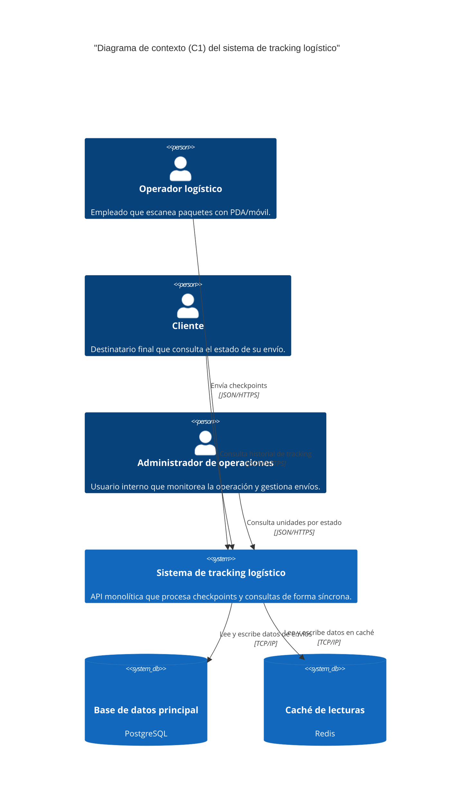

# C1: Diagrama de contexto del sistema

**Estado:** Aceptado
**Fecha:** 2025-11-18

## 1. Descripción

Este diagrama de nivel 1 (contexto) presenta una visión de alto nivel del **Sistema de tracking logístico**. Muestra el sistema como una "caja negra", enfocándose en sus interacciones con los usuarios (actores) y los sistemas de almacenamiento de datos que utiliza.

## 2. Diagrama (Mermaid)

