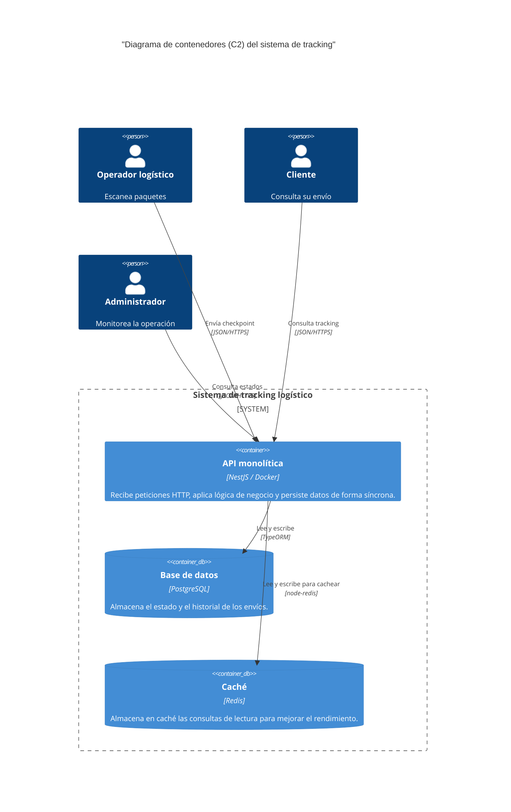

# C2: Diagrama de contenedores del sistema

**Estado:** Aceptado
**Fecha:** 2025-11-18

## 1. Descripción

Este diagrama de nivel 2 (contenedores) hace "zoom" dentro de la caja negra del **Sistema de tracking logístico**. Muestra las principales unidades desplegables (contenedores) que interactúan para entregar la funcionalidad.

Visualiza la arquitectura monolítica síncrona, donde una única API maneja todas las responsabilidades de negocio, interactuando directamente con la base de datos y el caché.

## 2. Diagrama (Mermaid)

