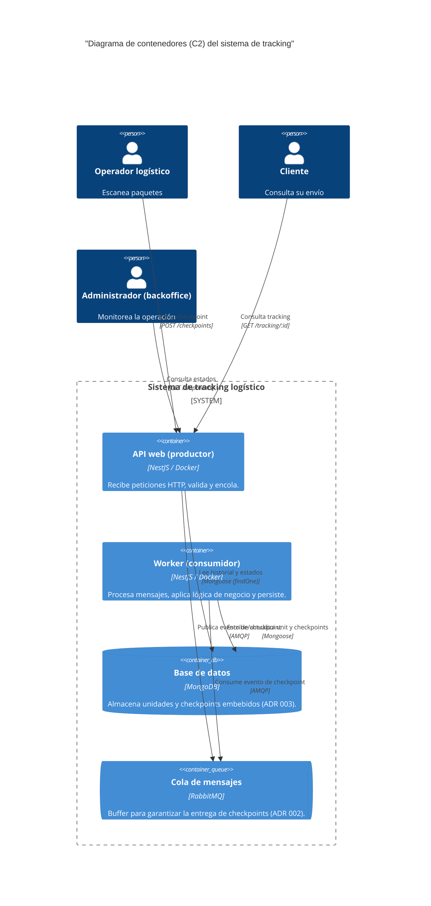

# C2: Diagrama de contenedores del sistema

**Estado:** Aceptado
**Fecha:** 2025-11-12

## 1. Descripción

Este diagrama de nivel 2 (contenedores) hace "zoom" dentro de la caja negra del **Sistema de tracking logístico**. Muestra los principales componentes de software (contenedores) que interactúan para entregar la funcionalidad.

Visualiza la decisión clave de arquitectura (ADR 002) de separar las peticiones (API) del procesamiento (worker) mediante una cola de mensajes.

## 2. Diagrama (Mermaid)

