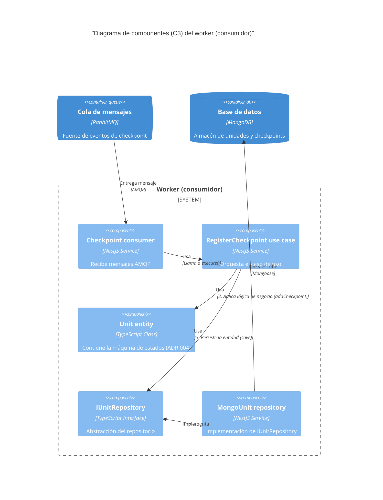

# C3: Diagrama de componentes (worker consumidor)

**Estado:** Aceptado
**Fecha:** 2025-11-12

## 1. Descripción

Este diagrama de nivel 3 (componentes) detalla la estructura interna del contenedor `Worker (consumidor)`.

Su responsabilidad es procesar de forma segura y resiliente los mensajes de la cola (ADR 002). Este diagrama ilustra cómo las capas de Arquitectura Limpia (ADR 001) colaboran para aplicar la lógica de negocio y persistir el resultado.

## 2. Diagrama (Mermaid)

