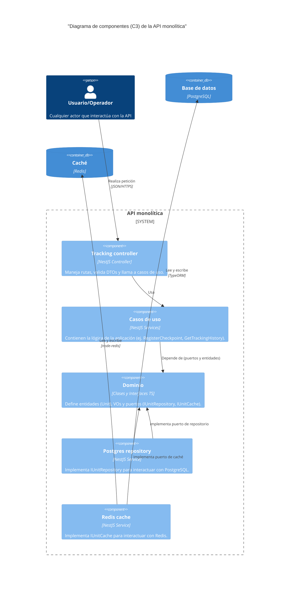

# C3: Diagrama de componentes de la API

**Estado:** Aceptado
**Fecha:** 2025-11-18

## 1. Descripción

Este diagrama de nivel 3 (componentes) detalla la estructura interna del contenedor `API monolítica`.

Muestra los componentes principales dentro de la aplicación NestJS y cómo orquestan el flujo de peticiones síncronas, aplicando los principios de Arquitectura Limpia (ADR 001). Se enfoca en la separación de responsabilidades:

*   **Presentation (controlador):** Recibe peticiones HTTP.
*   **Application (casos de uso):** Orquesta la lógica de negocio.
*   **Infrastructure (adaptadores):** Implementa la interacción con la base de datos y el caché.
*   **Domain (entidades y puertos):** Define las reglas y las interfaces.

## 2. Diagrama

