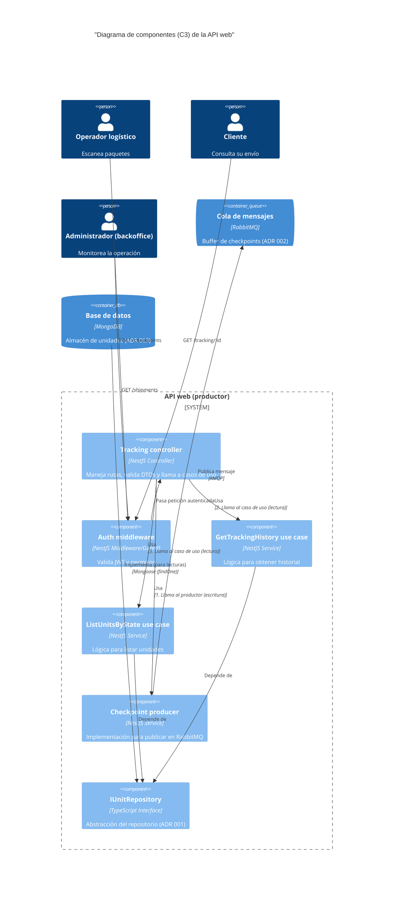

# C3: Diagrama de componentes (API web)

**Estado:** Aceptado
**Fecha:** 2025-11-12

## 1. Descripción

Este diagrama de nivel 3 (componentes) detalla la estructura interna del contenedor `API web (productor)`.

Muestra los componentes principales dentro de la aplicación NestJS y cómo orquestan el flujo de peticiones, aplicando los principios de Arquitectura Limpia (ADR 001). Se enfoca en la separación de responsabilidades:

* **Presentation (controlador):** Recibe HTTP.
* **Application (casos de uso):** Orquesta la lógica.
* **Infrastructure (repositorio, productor):** Interactúa con el exterior.

## 2. Diagrama

